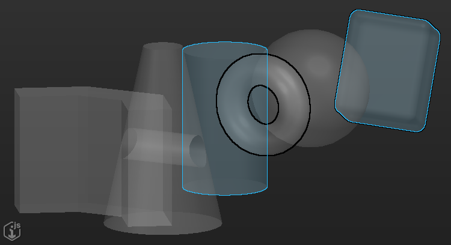

# NextVersion

## Color mix property added to thematic gradient settings

Thematic display gradient properties now supports a colorMix value for mixing the color of background map terrain or point clouds in with the thematic gradient color.  The `colorMix` property of [ThematicGradientSettings]($common) is a value between 0.0 and 1.0, defaulting to 0.0, which determines the percentage of the original color to blend in with the thematic gradient color (so 0.0 will be only the thematic gradient color, and 1.0 will be only the original terrain map or point cloud color).


<p align="center">Thematic rendering of background map terrain with colorMix set to 0.0, 0.33, and 0.67</p>

## Presentation

### `hideNodesInHierarchy` and grouping

Behavior of `hideNodesInHierarchy` attribute was changed when used in combination with grouping.

Previously the attribute meant that all nodes produced by the specification it was used on would be hidden, including grouping nodes. That made the combination useless, because grouping had absolutely no effect when used with `hideNodesInHierarchy`.

Now, only the instance nodes are hidden, but their grouping nodes (if any) are displayed. This makes it possible to create hierarchies like the following:

**Schema:**

```xml
<ECEntityClass typeName="A" />
<ECEntityClass typeName="A1">
  <BaseClass>A</BaseClass>
</ECEntityClass>
<ECEntityClass typeName="A2">
  <BaseClass>A</BaseClass>
</ECEntityClass>
<ECEntityClass typeName="B" />
<ECRelationshipClass typeName="A_B" strength="referencing" modifier="None" description="">
    <Source multiplicity="(0..*)" roleLabel="contains" polymorphic="true">
        <Class class="A"/>
    </Source>
    <Target multiplicity="(0..*)" roleLabel="is contained by" polymorphic="true">
        <Class class="B" />
    </Target>
</ECRelationshipClass>
```

**Instances:**

```
Classes:                                  Relationship "A_B"
+-------+-------------+-------+           +-----------+-----------+
| Class | Instance ID | Label |           | Source ID | Target ID |
+-------+-------------+-------+           +-----------+-----------+
| A1    |           1 | One   |           |         1 |         3 |
| A2    |           2 | Two   |           |         2 |         3 |
| B     |           3 | Three |
```

**Presentation rules:**

```json
rules: [{
  "ruleType": "RootNodes",
  "specifications": [{
    "specType": "InstanceNodesOfSpecificClasses",
    "classes": { "schemaName": "MySchema", "classNames": ["A"] },
    "groupByClass": true,
    "groupByLabel": false,
    "hideNodesInHierarchy": true
  }]
}, {
  "ruleType": "ChildNodes",
  "condition": "ParentNode.ClassName = \"A\"",
  "specifications": [{
    "specType": "RelatedInstanceNodes",
    "relationshipPaths": [{
        "relationship": { "schemaName": "MySchema", "className": "A_B" },
        "direction": "Forward"
    }],
    "groupByClass": false,
    "groupByLabel": false
  }]
}, {
  "ruleType": "ChildNodes",
  "condition": "ParentNode.ClassName = \"B\"",
  "specifications": [{
    "specType": "RelatedInstanceNodes",
    "relationshipPaths": [{
        "relationship": { "schemaName": "MySchema", "className": "A_B" },
        "direction": "Backward"
    }],
    "groupByClass": false,
    "groupByLabel": false
  }]
}]
```

**Result:**

```
+ A1          (class "A" grouping node)
+-+ Three     (instance node of class "B", ECInstanceId = 3)
| +-+ One     (instance node of class "A", ECInstanceId = 1)
+ A2          (class "A" grouping node)
+-+ Three     (instance node of class "B", ECInstanceId = 3)
  +-+ Two     (instance node of class "A", ECInstanceId = 2)
```

### `ContentInstancesOfSpecificClasses` specification and properties of derived classes

When `handleInstancesPolymorphically` attribute is set to `true`, only properties from specified classes used to be retrieved. We added a new attribute `handlePropertiesPolymorphically`, which tells the rules engine to also collect properties from derived classes.

```json
{
  "specType": "ContentInstancesOfSpecificClasses",
  "classes": [
    {"schemaName": "BisCore", "classNames": ["PhysicalElement"] },
  ],
  "handleInstancesPolymorphically": true,
  "handlePropertiesPolymorphically": true
}
```

### Nodes' duplication when using `RelatedInstanceNodes` specification

Behavior of `RelatedInstanceNodes` specification when used with many-to-x relationships was changed.

Previously, when traversing from a parent node, that is based on multiple instances on the "many" side of the relationship where the other side of the relationship points to the same other instance, we would see duplication.

Now, in the situation described above, there will be no more duplication.

### Breaking changes

- In `@bentley/presentation-backend` changed `cacheDirectory?: string` property to `cacheConfig?: HierarchyCacheConfig` on `PresentationManagerProps` interface. This adds ability to control cache mode.
Fix:

  ```ts
  Presentation.initialize({
    cacheConfig: { mode: HierarchyCacheMode.Disk, directory: "cacheLocation" },
  });
  ```

  instead of:

  ```ts
  Presentation.initialize({
    cacheDirectory: "cacheLocation",
  });
  ```

## Hilite/Emphasis interaction modified.

The visual interaction between hilited and emphasized geometry has been modified to look better.  Hilited geometry now always shows through emphasized geometry and visa versa.  Geometry which is both hilited and emphasized now shows the outline for both (provided they are of different widths).


<p align="center">Cylinder is hilited, Torus is emphasized, and Block is both hilited and emphasized.</p>
