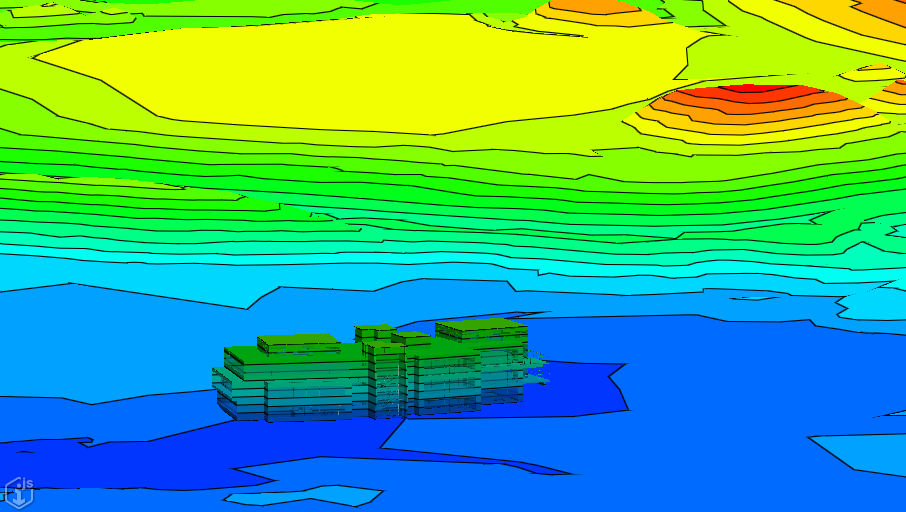

# NextVersion

## Thematic Display of Point Clouds and Background Terrain

Thematic display now supports point clouds and background terrain. If thematic display is enabled, point clouds and background terrain will be colorized using the corresponding thematic settings.

Note: Values of `ThematicDisplayMode.Slope` or `ThematicDisplayMode.HillShade` for the `displayMode` property of [ThematicDisplay]($common) do not affect point clouds or background terrain. If these thematic display modes are selected, they will be colorized normally without any of the thematic settings applied. In this case, surfaces in the scene will still be colorized using the thematic settings.


<p align="center">Thematic rendering applied to a point cloud</p>


<p align="center">Thematic rendering applied to background terrain</p>

### A new rule to override default property category

By default, all properties that don't have a defined category, fall under the default one, labeled "Selected Item(s)". In
some cases there is a need for that category to be labeled differently, and for that purpose there's now a new presentation
rule - `DefaultPropertyCategoryOverride`. Example:

```JSON
{
  "ruleType": "DefaultPropertyCategoryOverride",
  "specification": [{
    "id": "default",
    "label": "My Custom Default Property Category",
  }],
}
```
